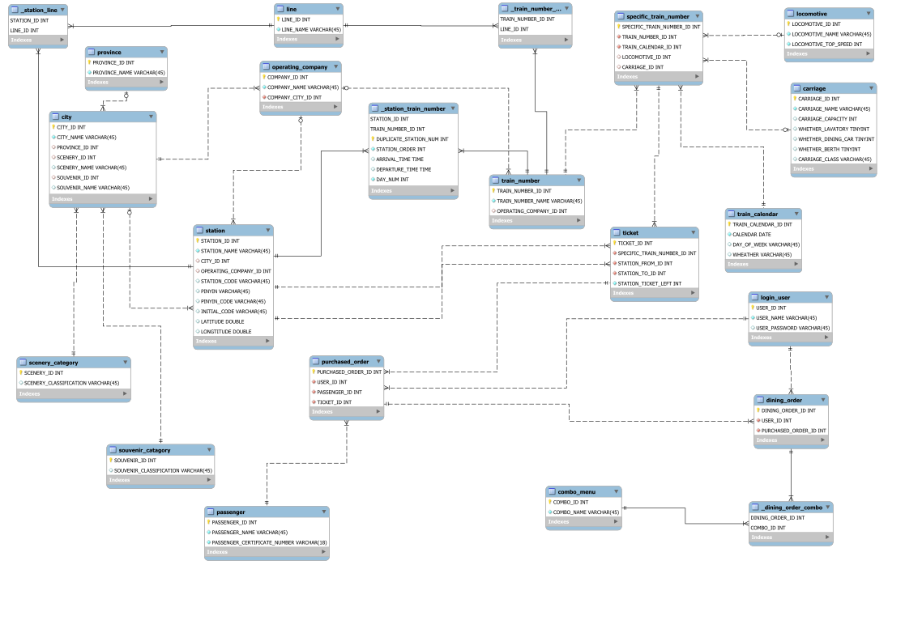

# China Railway Query System Project
The project aims to design a China railway management system that enables users to check the number of railway trips, ticket purchases and canceling, and railway food order. At the same time, several interfaces are reserved for managers to update and maintain the railway information. 

Our project is based on MySQL and JDBC. 

### System Requirement

#### User

* **Register** a new user account.
* **Log in** to existed account. 
* Query train ticket. This system provides three ways: 
  * **Fuzzy query**, in which case the user enters departure city, destination city and departure date, then presented with a time table of all train numbers that pass the outset city and get to the destination city, and also whether there is any ticket left. 
  * **Accurate query**, replace the city with specific stations, then the user can also get a table with the same columns of information as fuzzy query. 
  * **Line query**, users can query about departure and arrival times of all passing stations of a specific train number.
* **Book** a ticket of the most satisfying train number for a passenger not necessarily him or herself.
  * User should **add passenger record** into database, or use existed passenger information. 
  * User could **change departure date** or **cancel** a purchase if passenger's travel plan changed. The information about purchased orders and registered passengers should be available for consumers to check. 
  * User could **view** its purchased ticket information, as well as a passenger's ticket set. 
  * For instance, users can query all possible train numbers to change, then make the change and update a purchased train number to the new one. 
* User can **modify its username and password**,  in the premise that he or she enters the correct old password for authentication.
* We also provide consumers the option to **order a meal combo** bound with a purchased train ticket. Passengers could **query available meal combo**, order and **cancel order**, **view** one's order detail.  

#### Administrators

* **Initialize** data of available train numbers for the next 30 days. 
* When certain sections of a train line are affected by natural disasters or other bad situations, administrators should be able to **make adjustments to stops of train lines**.
* Administrators could **add**, modify or **delete** a train number due to the adjustment of the operation chart by CR.
* **Station** should also be able to be added or deleted. 
* Also, administrators can modify **meal combos**.

### Data Requirement

Generally, tables of domestic cities, subsidiary stations, and train numbers of trains running on lines that pass through all those stations are essential.

A city can have multiple stations, while a station is located in one certain city. Now, the table of train lines record the physical rails constructed to serve trains. The table of train numbers record all scheduled train trips that run on a certain line, a train number can illustrate information such as the type of train, designed top speed, and heading direction of this train. Finally, while the train numbers are essentially a design of daily routine, the specific train number table binds those train numbers to a specific date to create an actual schedule available in practice.

In addition to the above data that construct the train transportation system, information about locomotives, carriages, operating companies, and combo menus gives us insights in the travel experience and comfortableness of a trip, and information about sceneries and souvenirs of a city enables us to provide a more comprehensive view of a place and helps consumers plan their holidays.

Next, to store data of user information, we need tables of registered users, their purchased orders, the related passengers of each purchased train ticket, and finally the purchased dining combos.

#### Dependent Data

1. `city`: city information supporting fuzzy query.
2. `station`: station information supporting fuzzy query and accurate query.
3. `line`: information of physical rails supporting train number schedules.
4. `train_number`: date-insensitive schedule of train trips passing certain
   stations and running on certain lines.
5. `train_calendar`: a calendar supporting specific train number schedule.
6. `specific_train_number`: information of train numbers available on specific
   dates, map train numbers onto train calendar basically.
7. `ticket`: information of remaining tickets from a specific station to the
   destination.

#### Featured Data

1. `scenery_category`: classification of sceneries in different cities.
2. `souvenir_category`: classification of souvenirs of different cities.
3. `locomotive`: information of locomotives of physical trains.
4. `carriage`: information of carriges of physical trains.
5. `operating_company`: information of operating company of a train number or a
   station.
6. `combo_menu`: information of provided meal combos.

#### User information

1. `login_user`: information of a registered user account.
2. `purchased_order`: records of a user's purchased train tickets(numbers).
3. `passenger`: information of all passengers added to a user account.
4. `dining_order`: information of a user's purchased meal combos.

#### Relation Tables

1. `_station_line`
2. `_train_number_line`
3. `_station_train_number`
4. `_dining_order_combo`

### Data Model Design

#### ER Diagram

#### Dependent Data Tables

1. `city`
   * `CITY_ID`, `CITY_NAME`, `PROVINCE_ID`, `SCENERY_ID`, `SCENERY_NAME`,
     `SOUVENIR_ID`, `SOUVENIR_NAME`
2. `station`
   * `STATION_ID`, `STATION_NAME`, `CITY_ID`, `OPERATING_COMPANY_ID`,
     `STATION_CODE`, `PINYIN`, `PINYIN_CODE`, `INITIAL_CODE`, `LATITUDE`,
     `LONGITUDE`
3. `line`
   * `LINE_ID`, `LINE_NAME`
4. `train_number`
   * `TRAIN_NUMBER_ID`, `TRAIN_NUMBER_NAME`, `OPERATING_COMPANY_ID`
5. `train_calendar`
   * `TRAIN_CALENDAR_ID`, `CALENDAR`, `DAY_OF_WEEK`, `WEATHER`
6. `specific_train_number`
   * `SPECIFIC_TRAIN_NUMBER_ID`, `TRAIN_NUMBER_ID`, `TRAIN_CALENDAR_ID`,
     `LOCOMOTIVE_ID`, `CARRIAGE_ID`
7. `ticket`
   * `TICKET_ID`, `SPECIFIC_TRAIN_NUMBER_ID`, `STATION_FROM_ID`,
     `STATION_TO_ID`, `STATION_TICKET_LEFT`

#### Featured Data Tables

1. `scenery_category`
   * `SCENERY_ID`, `SCENERY_CLASSIFICATION`
2. `souvenir_category`
   * `SOUVENIR_ID`, `SOUVENIR_CLASSIFICATION`
3. `locomotive`
   * `LOCOMOTIVE_ID`, `LOCOMOTIVE_NAME`, `LOCOMOTIVE_TOP_SPEED`
4. `carriage`
   * `CARRIAGE_ID`, `CARRIAGE_NAME`, `CARRIAGE_CAPACITY`, `WHETHER_LAVATORY`,
     `WHETHER_BERTH`, `CARRIAGE_CLASS`
5. `operating_company`
   * `COMPANY_ID`, `COMPANY_NAME`, `COMPANY_CITY_ID`
6. `combo_menu`
   * `COMBO_ID`, `COMBO_NAME`

#### User information Tables

1. `login_user`
   * `USER_ID`, `USER_NAME`, `USER_PASSWORD`
2. `purchased_order`
   * `PURCHASED_ORDER_ID`, `USER_ID`, `PASSENGER_ID`, `TICKET_ID`
3. `passenger`
   * `PASSENGER_ID`, `PASSENGER_NAME`, `PASSENGER_CERTIFICATE`
4. `dining_order`
   * `DININING_ORDERED_ID`, `USER_ID`, `PURCHASED_ORDER_ID`

#### Relation Tables

1. `_station_line`
   * `STATION_ID`, `LINE_ID`
2. `_train_number_line`
   * `TRAIN_NUMBER_ID`, `LINE_ID`
3. `_station_train_number`
   * `STATION_ID`, `TRAIN_NUMBER_ID`, `DUPLICATE_STATION_NUM`, `STATION_ORDER`
4. `_dining_order_combo`
   * `DININING_ORDERED_ID`, `COMBO_ID`

### Techniques in Database

1. MySQL
2. Trigger, procedure
3. Java Database Connection
4. Optimized the speed of train number query by avoiding tables with large amount of data and using index in SQL
5. Optimized the speed of initializing left ticket data, from 1629830 ms to 102260 ms

### Considerations on Reliability and Security

1. Password security:

   1. Require to enter the old password for authentication when updating password
   2. Password encryption using SHA-1 hash function

   Query security:

   1. Support existence of loop lines
   2. Support train numbers that arrive on the next day of departure

### Original Ideas

1. Provide multiple options of query: fuzzy query, accurate query, and line query
2. Provide dining order services combined with a train trip
3. Provide scenery and souvenir information of certain cities

### Acknowledge

#### Data source

* [Parse12306](https://github.com/metromancn/Parse12306) released by *metromancn* under MIT license. 
* [CR station data](https://zhuanlan.zhihu.com/p/25497919) released by *nyydhx*, license unknown. 

